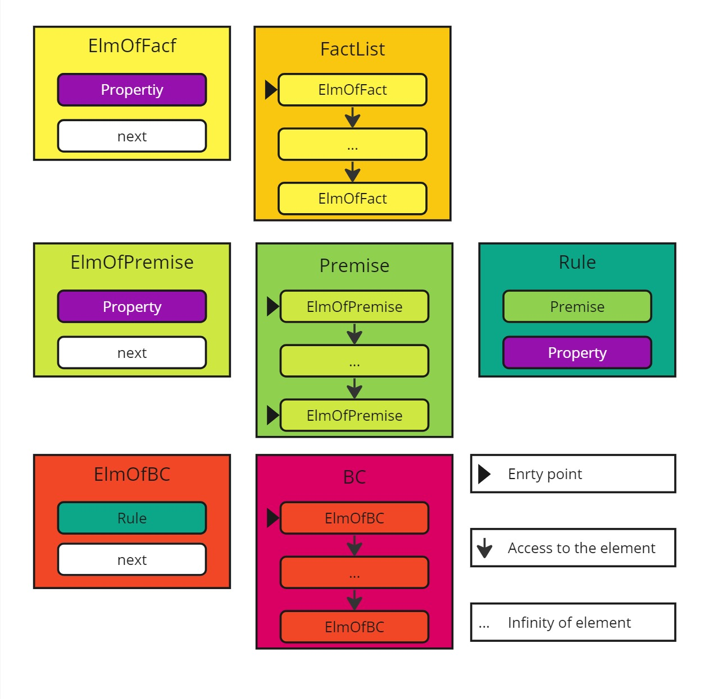

# Choix de conception

---
Dans cette section, nous allons détailler les choix de conceptions et d'implémentation des structures de données utilisées et la démarche adoptée pour les choisir.


## Analise du sujet

---
Après une analise rapide du sujet, nous avons remarqué qu'un parcours récursif de liste était nécessaire donc qu'une structure de liste simple serait favorables.

De plus nous avons aussi remarqué que les algorithms ne tirait pas d'avantages en termes de performances entre des listes simplement chainées et doublement chainées. Seul l'algorithme de suppression dans une liste est plus simple avec une liste doublement chainée.

## Types implémentés

Voici un récapitulatif des types implémenté et leurs utilités (sans distinctions entre pointeur et type).

---
### `Property`

Ce type est une réprésentation de ce qu'est un fait, une donnée. Cette représentation peut être changer au besoin et n'impacte pas le fonctionnement des algorithms.

---
### `FactList`

Ce type est une liste de `ElmOfFact` de taille infixe.

Une `FactList` est une liste de fait (`Property`) qui servent de base pour les autres types.

---
### `ElmOfFact`

Ce type est composé de deux champs :
* `fact` qui est de type `Property` et qui représente un fait, une donnée.
* `next` qui représente l'élément suivant de la liste.

Et représente un élément d'une liste de type `FactList`.

---
### `Premise`

Ce type est une liste de `ElmOfPremise` de taille infixe.

Une `Premise` est une liste de fait (`Property`) lier par la condition `ET`.

---
### `ElmOfPremise`

Ce type est composé de deux champs :
* `premise` qui est de type `Property` et qui représente un fait, une donnée.
* `next` qui représente l'élément suivant de la liste.

Et représente un élément d'une liste de type `Premise`.

---
### `Rule`

Ce type est composé de deux champs :
* `premise` de type `Premise` qui représente un ensemble de conditions a satisfaire.
* `conclusion` de type `Property` qui est le résultat si la premise satisfaite vrai.

Et représente une règle a satisfaire.

---
### `BC`

Ce type est une liste de `ElmOfBC` de taille infixe.

Une `BC` est liste de règle (`Rule`) afin de pouvoir faire résonner notre système expert.

---
### `ElmOfBC`

Ce type est composé de deux champs :
* `rule` qui est de type `Rule` et qui représente une règle.
* `next` qui représente l'élément suivant de la liste.

Et représente un élément d'une liste de type `BC`.


## Choix final

---
### Représentation des listes
Pour notre choix final nous avons décidé de réaliser uniquement des listes simplement chainées avec un unique champs de valeur et un type liste qui est uniquement un pointeur sur la structure étant définie comme un éléments de la liste. Cela nous donne une structure générique de type : 
```c
typedef struct elm{
    type premise;
    struct elm* next;
}ElementOfList;

typedef ElementOfList* List;
```
Dans notre cas les structures comme `Rule` et `ElmOfFact` ont des pointeurs sur une structure `Property` pour pouvoir au besoin comparer les emplacements mémoire si c'est le mode de comparaison choisi pour l'implementation

---
### Implementation de la donnée "fait"
En parlant de la structure `Property`, cette dernière représente le type de donner que l'on souhaite utiliser en tant que fait pour notre moteur expert donc tous peut être mis dedans et alors il faut modifier les fonctions suivantes:
* `isEmptyProperty` qui définie ce qu'est une `Property` vide
* `cmpProperty` qui définie comment est comparer deux `Property`
* `printProperties` qui défini un affichage pour une `Property`
* `affectField` qui permet de passer d'une allocation auto à manuelle de la donnée.

La fonction `affectField` est très importante car elle permet de rendre la donné accessible en mémoire en un unique point ce qui est utile si l'on veut se servire de l'emplacement mémoire comme identifiant de la donnée.

## Les structures implémenters et explication

---
### Fichier `FactList.h`
La structure `Property` qui représente un fait et donc peut contenir ce que l'on souhaite. Pour un exemple, merci de regarder la [section test](Test.md).
````c
typedef struct {
    type name;
    ...
    type name;
}Property;
````
La structure `ElmOfFact` définie un élément de la liste des faits. En complement la structure `FactList` sert à définir en la liste de fait en elle même.
````c
typedef struct elm{
    Property* fact;
    struct elm* next;
}ElmOfFact;

typedef ElmOfFact* FactList;
````
Ici `fact` est un pointeur sur un élément du type `Property` pour pouvoir comparées les emplacements mémoire.

---
### Fichier `Rules.h`
La structure `ElmOfPremise` sert à définir un élément de la liste qui a pour type `Premise` et qui est seulement un pointeur. Dans ce cas l'élément passer au champs `premise` doit provenir d'une `FactList`.
````c
typedef struct elm{
    Property* premise;
    struct elm* next;
}ElmOfPremise;

typedef ElmOfPremise * Premise;
````
La structure `Rule` sert à définir une règle avec ça `premise` de type `Premise` et sa `conclusion` qui vien aussi d'une `FactList`.
````c
typedef struct{
    Premise premise;
    Property* conclusion;
}Rule;
````

---
### Fichier `BC.h`
La structure `ElmOfBC` représente un élément d'une **Base de Connaissance**. Une **Base de Connaissance** est une liste de règle représenté par le type `BC`.
````c
typedef struct elm{
    Rule* rule;
    struct elm* next;
}ElmOfBC;

typedef ElmOfBC * BC;
````

---

### Schéma des structures

Si jamais les explications écrites et morceaux de codes ne vous onts pas sufis voici un shéma qui résume le tout.



---
C'est tout pour cette section, vous pouvez passer a la section suivante : [Fonctionnement du système expert](Functioning.md)


